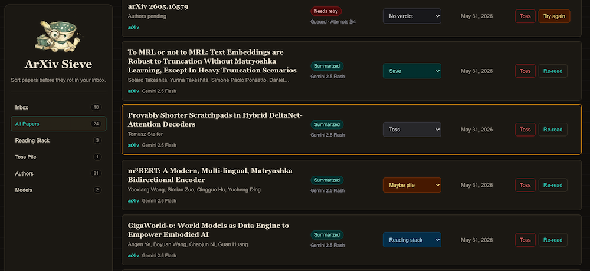

# ArXiv Sieve

Sort papers before they rot in your inbox.

ArXiv Sieve is a small research desk for turning Scholar Inbox emails and arXiv links into a searchable paper library. It queues papers, summarizes them with Gemini, sends one email report per paper, and keeps the whole triage loop visible in a clean ops view.



## What It Does

- Accepts manual arXiv URLs and Scholar Inbox links.
- Ingests Scholar Inbox digest emails through Google Apps Script.
- Marks successfully ingested Gmail threads processed, with an opt-in read toggle.
- Resolves Scholar Inbox links without leaking private `sha_key` values.
- Queues papers in Supabase and processes ready jobs with retry/backoff.
- Summarizes papers with Gemini: overview, contributions, prior-work delta, and project ideas.
- Sends one Resend report email per paper with signed verdict links.
- Provides a dev-mode Chrome extension for adding arXiv pages with an optional initial verdict.
- Lets the curator rate papers, save project ideas, delete/reprocess/retry papers, and resend failed report emails.
- Keeps `/api/papers` public while all write actions require the curator passphrase cookie.
- Includes Activity/Ops views for current issues plus append-only event history: ingests, queue runs, job claims/completions/retries, report email status, and curator actions.
- Adds paper, project, author, and model views with search, filters, grid/list modes, and lightweight ranking.
- Ships a lightweight PWA manifest so the existing mobile web flow can evolve toward web push before any native app work.

## Stack

- Next.js App Router
- Supabase Postgres
- Gemini via `@google/genai`
- Resend for report emails
- Vercel for hosting
- Google Apps Script for Gmail polling

## Product Shape

- **Public library:** anyone can browse papers.
- **Curator mode:** one passphrase unlocks write operations.
- **Queue runner:** manual Summarize clears all ready jobs; automatic post-ingest processing stays intentionally small.
- **Activity/Ops:** clickable issue tiles explain what is blocked and provide actions like opening papers or resending report emails.
- **Email loop:** report emails include signed verdict links, so ratings can be changed from email without logging in.

## Local Setup

```bash
npm install
cp .env.example .env.local
npm run dev
```

Open `http://localhost:3000`.

## Environment

Create `.env.local` with the values from `.env.example`. The important split is:

- public visitors can read `/api/papers`
- admin-only routes require `ADMIN_PASSWORD` and `ADMIN_SESSION_SECRET`
- Apps Script uses `EMAIL_INGEST_SECRET`
- signed email verdict buttons use `EMAIL_ACTION_SECRET`
- the local Chrome extension uses `EXTENSION_API_SECRET`
- queue processing can be triggered by admin actions, email ingest, or cron-style calls
- `APP_BASE_URL` must be the deployed URL in production so email links point to the right app
- Resend requires a verified sender domain for `REPORT_EMAIL_FROM`

## Database

Run `supabase/schema.sql` in your Supabase project. It defines:

- `papers`
- `paper_processing_jobs`
- `gmail_ingested_messages`
- `saved_project_ideas`
- login rate-limit/audit tables
- `admin_audit_events`, currently used as the append-only activity log

## Gmail Ingest

Copy `scripts/google_apps_script.gs` into Google Apps Script, set:

- `PAPER_LIBRARY_WEBHOOK` to `https://your-domain/api/ingest/scholar-email`
- `PAPER_LIBRARY_SECRET` to the same value as `EMAIL_INGEST_SECRET`

The script logs sanitized diagnostics and labels processed threads so failed webhook calls can be retried.
By default `MARK_READ_ON_SUCCESS` is `true`, so Gmail threads are marked read only after the webhook returns 2xx.

## Chrome Extension

The unpacked extension lives in `chrome-extension/`. Set `EXTENSION_API_SECRET`,
load that folder through `chrome://extensions` with Developer mode enabled, then
save your deployed app URL and the same secret in the extension options.

It tries to show a right-edge **Sieve** button on arXiv pages and also includes a
toolbar popup fallback for Chrome PDF viewer pages.

## Intentional Non-Features

- Scholar Inbox rating sync is not implemented yet because there is no stable public rating-write API. The practical fallback is to open Scholar Inbox links manually when you want to update recommendation training there.
- Native iPhone/Apple Watch notifications are deferred. The next reasonable mobile step is web push for an installed PWA, keeping email verdict links as the reliable baseline.

## Quality Checks

```bash
npm run lint
npm run build
npm test
```

The tests are HTTP smoke tests against the real Next API routes. They intentionally run without Supabase credentials to verify auth boundaries and configuration failures.

## Why It Exists

Scholar alerts are easy to ignore because each email is a tiny decision tax. ArXiv Sieve turns that stream into a queue, extracts the useful parts, and makes triage fast enough that reading actually happens.
